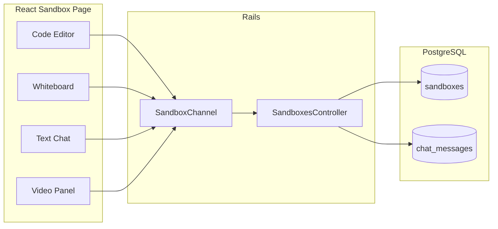

# Drawcode: Step-by-Step Build Plan

A step-by-step plan to build Drawcode: shareable sandboxes (no login) with real-time code editing, a collaborative whiteboard, text chat, and video/voice—using the existing Rails 8 + Inertia/React stack and Action Cable for real-time sync.

## Todo list (complete in order)

1. **Phase 1: Create Sandbox model, migration** (slug, title, code, drawing), run migrations.
2. **Phase 1: Add routes** — GET /, POST /sandboxes, GET /s/:slug; mount ActionCable at /cable.
3. **Phase 1: Add HomeController and SandboxesController** — create, show; render Inertia with props.
4. **Phase 1: Add React pages** — landing (pages/home) and sandbox shell (pages/sandboxes/show).
5. **Phase 2: Create SandboxChannel** — stream by slug; handle `code_updated` (persist + broadcast).
6. **Phase 2: Add CodeEditor and Cable sync** — Monaco/CodeMirror, useSandboxChannel hook, sync code.
7. **Phase 3: Persist drawing** — store on Sandbox; handle `drawing_stroke` in channel; pass in show props.
8. **Phase 3: Add Whiteboard component** — canvas, pen/eraser; send/receive strokes via Cable.
9. **Phase 4: ChatMessage model and channel** — model + migration; handle `chat_message` in channel; load last N in show.
10. **Phase 4: Chat UI** — Chat component (message list + input), send/receive via Cable.
11. **Phase 5: Video/voice** — VideoPanel (WebRTC + Cable signaling or third-party); display names.
12. **Phase 6: Layout** — Final sandbox layout (code + canvas + chat + video), Share/Copy link, responsive.
13. **Phase 6: Presence** — user_joined/user_left and participant list in UI.
14. **Phase 6: Polish** — Sandbox title edit (PATCH), 404 page, Cable reconnect message, landing copy.

---

## Architecture overview

- **Single sandbox page** (one URL per room): code + canvas + chat + video in one view.
- **No auth**: create sandbox → get shareable link → anyone with link can join.
- **Real-time**: Action Cable channel per sandbox for code, drawing, and chat; WebRTC (or third-party) for video/voice.
- **Persistence**: sandbox record stores code + drawing snapshot so “save the link” restores state.

---

## Phase 1: Sandbox model and creation (no login)

**Goal:** Create a sandbox and redirect to a shareable URL; no sign-up or sign-in.

1. **Model and DB**
  - Add `Sandbox` model: `slug` (unique, index, e.g. `SecureRandom.urlsafe_base64(8)`), `title` (optional string), `code` (text, default `""`), `drawing` (jsonb or text for canvas state), `created_at` / `updated_at`.
  - Migration: `rails g model Sandbox slug:string:uniq title:string code:text drawing:jsonb` (or `drawing:text` if you store JSON string), then add non-null/defaults as needed.
  - No `User` or `Session` model; identity in a room can be a transient “display name” (see Phase 5).
2. **Routes**
  - `GET /` → show landing page (e.g. “Create a sandbox” button + short product pitch).
  - `POST /sandboxes` → create sandbox, redirect to `GET /s/:slug`.
  - `GET /s/:slug` → show sandbox (404 if not found). This is the **only** sandbox UI route.
3. **Controllers**
  - **Landing:** e.g. `HomeController#index` → Inertia render of a small React landing page (single CTA: “Create sandbox”).
  - **Sandboxes:** `SandboxesController#create` (create Sandbox, redirect to `/s/:slug`), `SandboxesController#show` (find by `slug`, render Inertia sandbox page with props: `sandbox: { slug, title, code, drawing }` and optionally `chat_messages` for initial load).
4. **React**
  - **Landing page:** `pages/home/index.jsx` — minimal UI with button that POSTs to `/sandboxes` (or uses Inertia `router.post`) and follows redirect to `/s/:slug`.
  - **Sandbox page:** `pages/sandboxes/show.jsx` — shell layout only (placeholder areas for editor, canvas, chat, video). Use the slug from the URL or from Inertia props so the client can subscribe to the correct channel later.

**Deliverable:** Visiting `/`, clicking “Create sandbox”, and opening `/s/<slug>` shows the sandbox shell with the correct slug and initial `code`/`drawing` from the server.

---

## Phase 2: Code editor with persistence and real-time sync

**Goal:** One code area per sandbox; edits persist to the DB and sync to all participants in real time.

1. **Backend**
  - **Action Cable channel:** `SandboxChannel` (e.g. `stream_for sandbox` or `stream_from "sandbox_#{params[:slug]}"`). Authenticate by verifying the sandbox exists (no user auth).
  - **Broadcasts:** When the server receives a “code_updated” message (new content + optional cursor/selection if you want), update `sandbox.update!(code: content)` and broadcast to the channel so other clients can apply the same change (or full document replace).
  - **Controller:** Optional `PATCH /sandboxes/:slug` or use only Cable for code updates to avoid duplicate writes; or have the client that edited send to Cable and the server persist + broadcast. Prefer one source of truth: server persists and broadcasts.
2. **Frontend**
  - **Code editor component:** Integrate an editor in the sandbox page (e.g. **Monaco** via `@monaco-editor/react` or **CodeMirror 6**). Load initial `code` from Inertia props.
  - **Action Cable consumer:** In the sandbox page, subscribe to `SandboxChannel` with the slug. On “code_updated” from server, update the editor content (and optionally cursor) without overwriting local unsent changes if you use operational transform or last-write-wins with timestamps; for v1, simple “full document replace” on receive is fine.
  - **Sending edits:** On local edit (e.g. debounced or on blur), send the full code to the server via Cable; server updates `sandbox.code` and broadcasts to others.
3. **Persistence**
  - Ensure every code update that goes through the channel is also saved to `sandbox.code` so that reloading the page or sharing the link later shows the latest code.

**Deliverable:** Two browser windows on the same `/s/:slug` see the same code; edits in one appear in the other and are saved so refresh keeps them.

---

## Phase 3: Collaborative whiteboard (drawing)

**Goal:** A canvas where everyone can draw; strokes sync in real time and are persisted so the drawing is restored when someone opens the link later.

1. **Data model**
  - **Option A:** Store a single `drawing` blob on `Sandbox` (e.g. JSON array of strokes: `[{ tool, color, width, points: [[x,y], ...] }, ...]`). Append new strokes and broadcast.
  - **Option B:** Separate `DrawingStroke` model with `sandbox_id`, `payload` (jsonb), `created_at` — easier to trim old strokes later; on load, fetch last N strokes then subscribe for new ones.
2. **Backend**
  - **Channel:** Reuse `SandboxChannel`. On “drawing_stroke” (stroke payload), persist (append to `sandbox.drawing` or create `DrawingStroke`), then broadcast to channel so other clients can draw the same stroke.
  - **Initial load:** In `SandboxesController#show`, pass current `drawing` (or list of strokes) as Inertia props so the canvas can render the existing state before applying live updates.
3. **Frontend**
  - **Canvas component:** Use HTML5 Canvas (or a thin library like **perfect-freehand** for smooth lines). Tools: pen (with color/size), eraser (optional). Capture pointer events, serialize stroke (e.g. `{ tool, color, width, points }`), send to server via Cable; on receive, replay stroke on canvas.
  - **Sync:** When receiving a stroke from Cable, draw it on the local canvas so all participants see the same picture. Avoid re-sending the same stroke (e.g. mark strokes with a client or server id so the sender doesn’t re-apply).

**Deliverable:** Multiple users on the same sandbox see each other’s drawings in real time; after refresh or opening the link later, the drawing is still there.

---

## Phase 4: Text chat

**Goal:** Chat messages in the sandbox, persisted and visible to everyone who has the link.

1. **Backend**
  - **Model:** `ChatMessage` with `sandbox_id`, `author_name` (string, optional — “User 1”, or let user type a name), `body` (text), `created_at`. No user_id.
  - **Channel:** Same `SandboxChannel`. On “chat_message” (author_name, body), create `ChatMessage`, broadcast to channel (with id, author_name, body, created_at).
  - **Initial load:** In `show`, pass last 50 (or N) `chat_messages` as Inertia props so the client can render history; new messages arrive via Cable.
2. **Frontend**
  - **Chat UI:** A panel in the sandbox page: message list (scroll to bottom) + input. On submit, send `{ author_name, body }` via Cable; on receive (including own message echoed from server), append to list.

**Deliverable:** Participants can type messages, see them in real time, and see chat history when they (or someone else) open the link later.

---

## Phase 5: Video and voice (WebRTC or third-party)

**Goal:** Allow participants in a sandbox to do video/voice without leaving the app.

**Option A — WebRTC with Action Cable signaling (no extra services):**

1. **Signaling:** Use `SandboxChannel` to exchange WebRTC signaling (offer, answer, ICE candidates) between peers. When a user joins, they request or create a “room” identified by sandbox slug; others in the same slug receive their stream.
2. **Identity:** No login — use a temporary display name (e.g. “User 1”, or prompt on join) and send it with signaling so the UI can show “Alice” vs “Bob”.
3. **Frontend:** React component that uses `getUserMedia` and `RTCPeerConnection`, subscribes to Cable for signaling, and renders remote video elements. For 2 people, single peer connection; for 3+, use a mesh (multiple peer connections) or consider a server (next option).

**Option B — Third-party (e.g. LiveKit, Daily.co, Twilio):**

1. **Backend:** Create a “room” or “token” endpoint per sandbox (e.g. `POST /sandboxes/:slug/webrtc_token` or similar) that returns a short-lived token or room URL from the provider.
2. **Frontend:** Embed the provider’s SDK; join with the token/URL. No need to implement signaling or ICE yourself; scaling and reliability are handled by the provider.

**Recommendation:** Start with **Option A** for minimal dependencies and to keep “no login” and “just share a link”; if you need more than 2–3 participants or better reliability, add **Option B** later.

**Deliverable:** Two (or more) users on the same sandbox can start video/voice and see/hear each other.

---

## Phase 6: UI layout, participant list, and polish

**Goal:** One coherent sandbox screen: code, draw, chat, and video in a clear layout; show who’s in the room; make “share link” obvious.

1. **Layout**
  - **Desktop:** e.g. left: code editor + canvas (tabs or split); right: chat + video (stacked or tabs). Or code top-left, canvas top-right, chat + video bottom. Use Tailwind and a simple responsive layout so it works on smaller screens (stack or collapse panels).
  - **Share link:** Prominent “Share” or “Copy link” that copies `window.location.href` (or a short link you generate) so users can paste into Zoom/Slack/email.
2. **Participant list**
  - **Presence:** Use the same `SandboxChannel` to broadcast “user_joined” / “user_left” (with a temporary id and display name). Maintain a list of “current participants” in React state; render avatars or names in the video area or a small sidebar. No need to persist presence to DB.
3. **Polish**
  - **Titles:** Allow editing sandbox title (e.g. inline or small modal) and persist via `PATCH /sandboxes/:slug` so the link is more recognizable when saved.
  - **Landing:** Short copy (“Code, draw, and video chat in one place — no sign-up. Create a sandbox and share the link.”) and maybe a “Try it” that creates a sandbox and redirects.
  - **Errors:** 404 page for invalid slug; friendly message if Cable disconnects (e.g. “Reconnecting…”).

---

## Suggested implementation order

| Step | What                                                                                                                 |
| ---- | -------------------------------------------------------------------------------------------------------------------- |
| 1    | Sandbox model, migrations, routes, `HomeController` + `SandboxesController`, landing + sandbox shell page (Phase 1). |
| 2    | `SandboxChannel`, code editor component, Cable subscribe/broadcast, persist code (Phase 2).                          |
| 3    | Drawing: canvas component, stroke format, persist + broadcast drawing (Phase 3).                                     |
| 4    | `ChatMessage` model, chat UI, persist + broadcast chat (Phase 4).                                                    |
| 5    | Video/voice: WebRTC + Cable signaling or third-party (Phase 5).                                                      |
| 6    | Layout, share link, presence, title edit, 404, copy (Phase 6).                                                       |

---

## Key files to add or touch

- **Rails:** `app/models/sandbox.rb`, `app/models/chat_message.rb`, `db/migrate/...`, `app/channels/sandbox_channel.rb`, `app/channels/application_cable/connection.rb` (optional auth by sandbox slug), `config/routes.rb`, `app/controllers/home_controller.rb`, `app/controllers/sandboxes_controller.rb`.
- **React:** `app/javascript/pages/home/index.jsx`, `app/javascript/pages/sandboxes/show.jsx`, `app/javascript/components/CodeEditor.jsx` (or similar), `app/javascript/components/Whiteboard.jsx`, `app/javascript/components/Chat.jsx`, `app/javascript/components/VideoPanel.jsx`, and a small Action Cable hook or context (e.g. `useSandboxChannel(slug)`).
- **Config:** Mount Action Cable in `config/routes.rb` (`mount ActionCable.server => '/cable'`) if not already; ensure `application.js` or the Inertia entrypoint has the Cable consumer (e.g. `createConsumer()` from `@rails/actioncable`).

---

## Tech choices summary

| Feature     | Suggestion                                                                                           |
| ----------- | ---------------------------------------------------------------------------------------------------- |
| Code editor | Monaco (`@monaco-editor/react`) or CodeMirror 6 — both work in React and support many languages.     |
| Drawing     | Canvas API + optional **perfect-freehand** for smooth strokes; store strokes as JSON.                |
| Real-time   | Action Cable (already in place); one channel per sandbox for code, drawing, chat, and signaling.     |
| Video       | WebRTC with Cable signaling for v1; optional move to LiveKit/Daily later for scale.                  |
| Identity    | No accounts; optional display name (stored in session or only in Cable presence) for chat and video. |

This plan gets you from the current boilerplate to a single place where users can create a sandbox, share the link, and code, draw, chat, and video-call together, with state persisted so the link is useful later.
